# Описание работы всех используемых endpoint-ов

## Регистрация
Для начала надо зарегистрировать нашего библиотакаря. Для этого нам надо получить токен админа:
1) Работа происходит через Django shell
```
python manage.py shell
```
2) Смотрим кто сейчас админ
```
from django.contrib.auth.models import User
admins = User.objects.filter(is_superuser=True)
for admin in admins:
    print(admin.username)
```
3) Назначим токен админу
```
python manage.py drf_create_token Dora
```
4) Я получила сообщение с токеном
```
Generated token 7a239e6c01c77adad2dae14de9a4c87d85fdb3bb for user Dora
```

## Описание работы endpoint-ов

## Эндпоинты для книг

- **Получение списка книг или добавление новой книги:**
    - GET и POST: http://127.0.0.1:8000/api/books/
  
    GET (получение списка книг):
    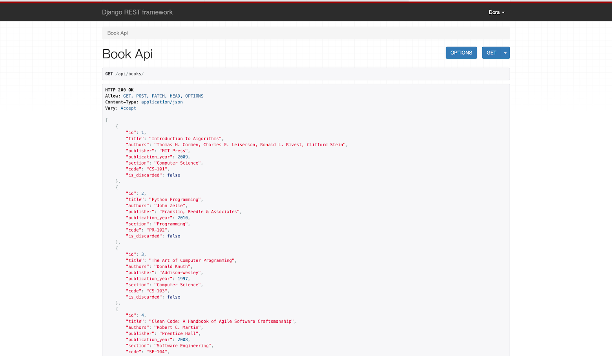
    Запрос `GET /api/books/` возвращает список всех книг в библиотеке с их деталями, включая название, авторов, издательство, год публикации, раздел и статус списания.
   
    POST (создание книги):
    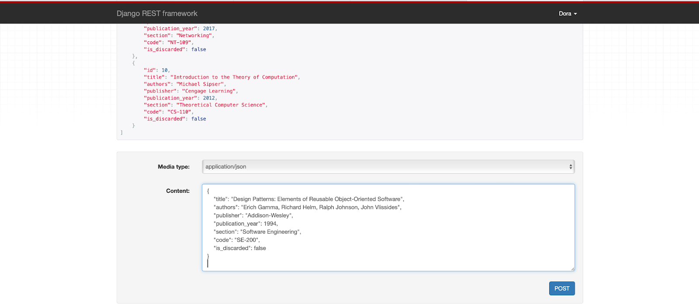
    
    Запрос `POST /api/books/` используется для добавления новой книги в библиотеку. В теле запроса передаются данные о книге в формате JSON, включая название, авторов, издательство, год публикации, раздел, шифр и статус списания.

    - GET (по id): http://127.0.0.1:8000/api/books/<int:pk>/
    
    GET (получение информации для книги по id):
    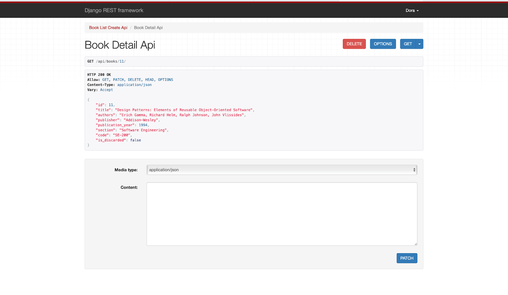

    - PATCH (обновление по id): http://127.0.0.1:8000/api/books/<int:pk>/
  
    PATCH (обновление информации для книги по id):
    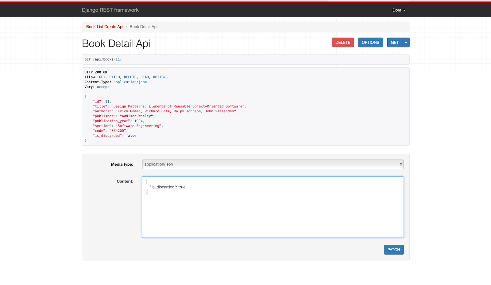
    
    Запрос `PATCH /api/books/11/` используется для частичного обновления информации о книге с ID 11. В данном случае пример показывает изменение поля `is_discarded` на `true`, чтобы пометить книгу как списанную.

    - DELETE (удаление по id): http://127.0.0.1:8000/api/books/<int:pk>/
  
    DELETE (удаление по id):
    
    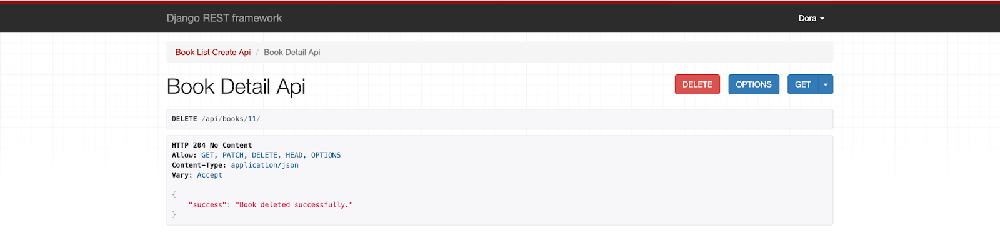

- **Получение списка просроченных книг (выданных более месяца назад):**

    - GET: http://127.0.0.1:8000/api/books/late/
    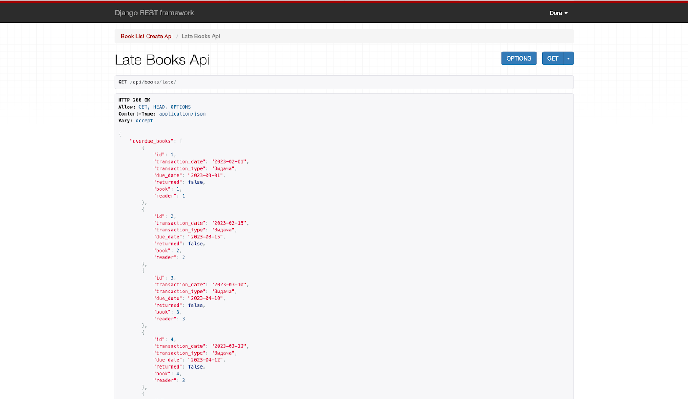
    Запрос `GET /api/books/late/` возвращает список книг, которые просрочены (выданы более месяца назад). Ответ содержит информацию о транзакциях, включая дату выдачи, тип транзакции, срок возврата, статус возврата, ID книги и читателя.
- **Перенос экземпляра книги в другой зал:**

    - POST: http://127.0.0.1:8000/api/books/<int:book_copy_id>/transfer/
    
    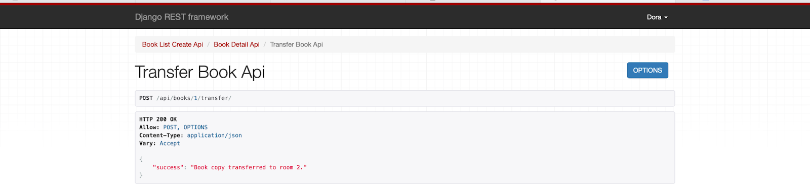
    Запрос POST /api/books/<book_id>/transfer/ используется для переноса экземпляра книги в другой читальный зал. В теле запроса указывается room_id, чтобы задать новый зал, к которому будет прикреплена книга.
- **Добавление и удаление экземпляров книги:**

    - POST и DELETE: http://127.0.0.1:8000/api/books/<int:book_copy_id>/manage_copies/
  
    POST (добавление экземпляров книги):
    
    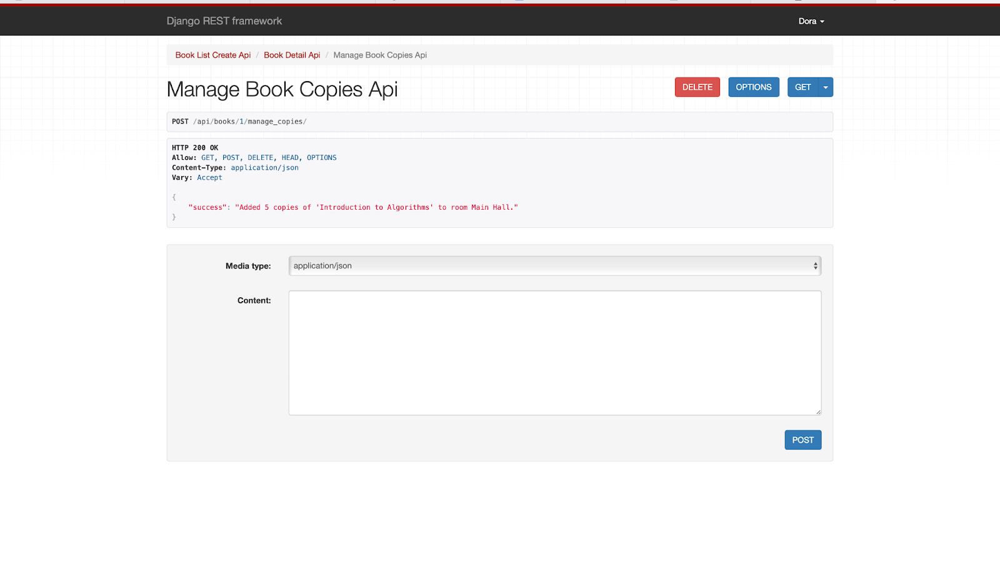
    Запрос `POST /api/books/<book_id>/manage_copies/` добавляет экземпляры книги в указанный зал, принимая `quantity` и `room_id` в теле запроса.

    DELETE (удаление экземпляров книги):
    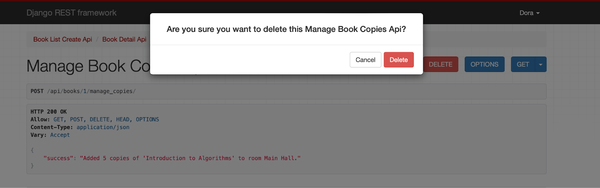
    DELETE удаляет определенное количество экземпляров из указанного зала.
- **Обновление шифра книги:**

    - PATCH: http://127.0.0.1:8000/api/books/<int:room_id>/update_code/
    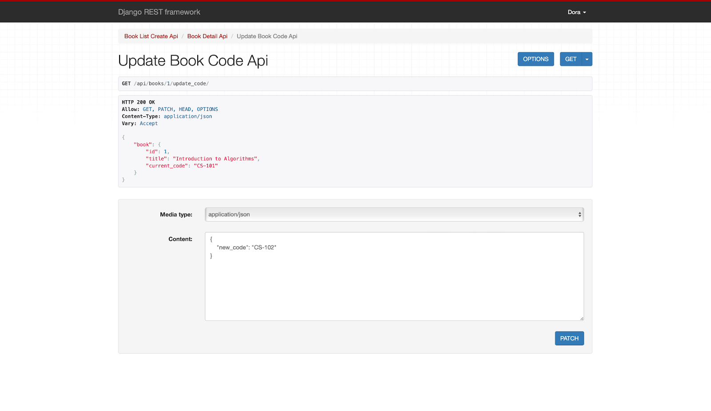
    
    Эндпоинт `PATCH /api/books/<book_id>/update_code/` используется для обновления шифра книги. В теле запроса передается новый код, который заменяет текущий.
  
- **Получение списка книг с количеством экземпляров <= 2:**

    - GET: http://127.0.0.1:8000/api/books/low_stock/
    
    Эндпоинт `GET /api/books/low_stock/` возвращает список книг с количеством экземпляров, равным или меньшим двум, вместе с информацией о книгах и связанных читателях.

## Эндпоинты для читателей

- **Получение списка читателей или добавление нового читателя:**
    - GET и POST: http://127.0.0.1:8000/api/readers/
  
    GET (получение списка читателей):
    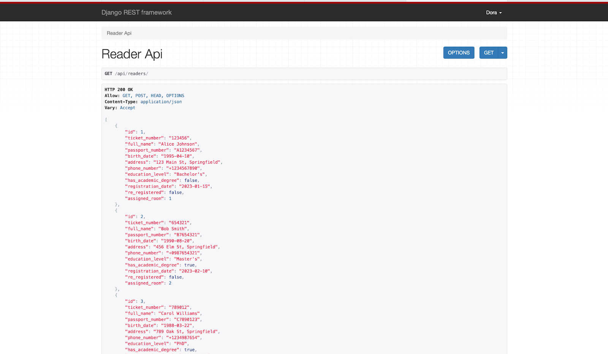
    Эндпоинт `GET /api/readers/` возвращает список читателей библиотеки с информацией о каждом из них, включая номер читательского билета, полное имя, паспортные данные, дату рождения, адрес, уровень образования и привязанный читальный зал.

    POST (добавление нового читателя):
    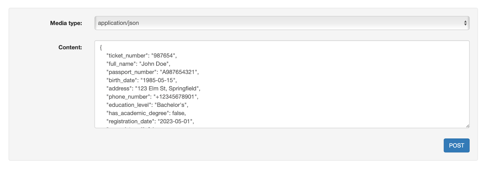
    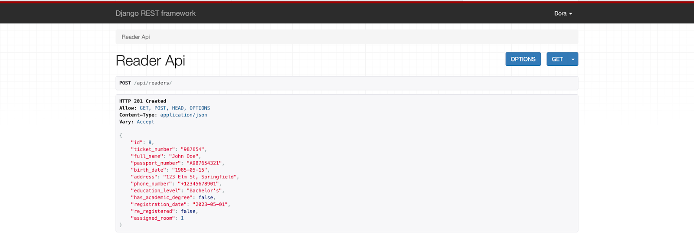
    Эндпоинт `POST /api/readers/` используется для добавления нового читателя. В теле запроса передаются данные читателя, такие как номер билета, имя, паспортные данные, дата рождения, адрес, номер телефона, уровень образования и другие детали.

- **Получение списка книг, закрепленных за конкретным читателем:**

    - GET: http://127.0.0.1:8000/api/readers/<int:reader_id>/books/
    
    Эндпоинт `GET /api/readers/<reader_id>/books/` возвращает список книг, закрепленных за конкретным читателем, включая информацию о транзакциях, таких как дата выдачи, срок возврата и статус возврата.
  
- **Удаление читателей, которые не перерегистрировались в течение года:**

    - DELETE: http://127.0.0.1:8000/api/readers/remove_old/ 
    
    Эндпоинт DELETE /api/readers/remove_old/ удаляет читателей, которые не перерегистрировались в течение года.
  
- **Перемещение читателя в другой зал:**

    - POST: http://127.0.0.1:8000/api/readers/<int:reader_id>/transfer/
    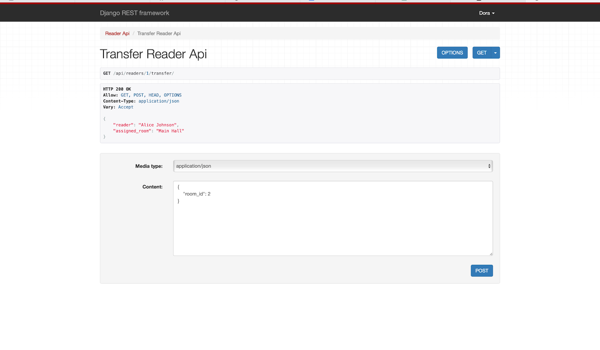
    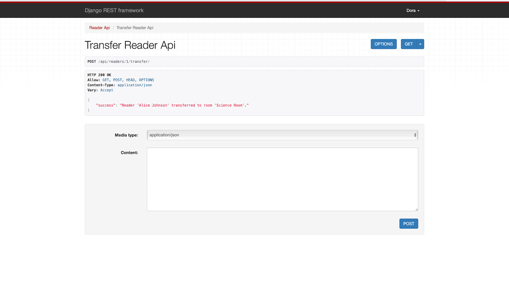
    Эндпоинт `POST /api/readers/<reader_id>/transfer/` используется для переноса читателя в другой читальный зал. В теле запроса передается `room_id`, указывающий новый зал, к которому будет прикреплен читатель.

- **Обновление номера читательского билета:**

    - PATCH: http://127.0.0.1:8000/api/readers/<int:reader_id>/update_ticket/
    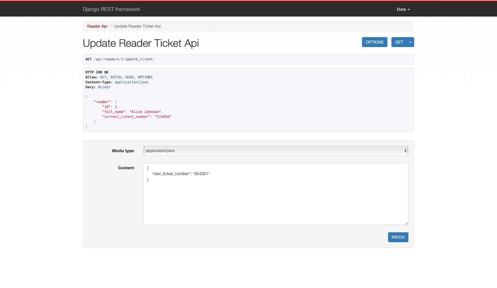
    
    Эндпоинт `PATCH /api/readers/<reader_id>/update_ticket/` используется для обновления номера читательского билета. В теле запроса передается новый номер билета через параметр `new_ticket_number`.

## Эндпоинты для читальных залов

- **Получение списка читальных залов и создание нового:**

    - POST и GET: http://127.0.0.1:8000/api/reading_rooms/
  
    GET (получение списка читальных залов):
    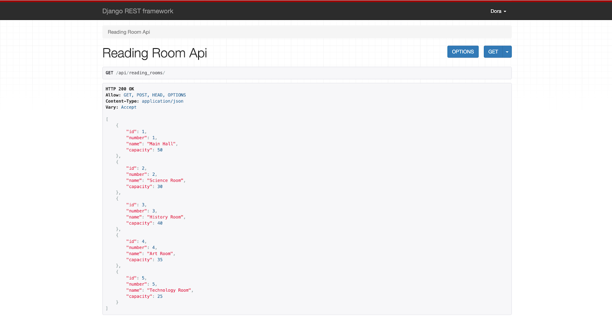
    Эндпоинт `GET /api/reading_rooms/` возвращает список всех читальных залов с их характеристиками, включая идентификатор, номер, название и вместимость каждого зала.

    POST (создание нового читательного зала):
    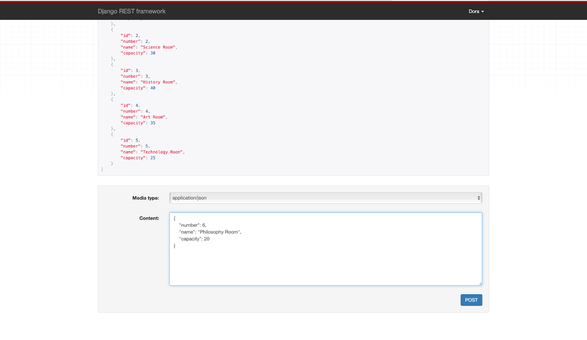
    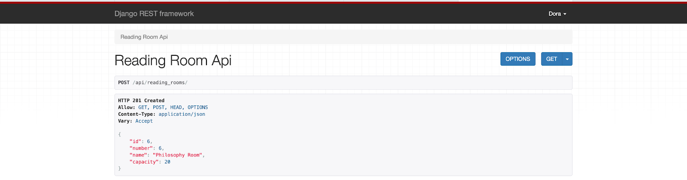
    Эндпоинт `POST /api/reading_rooms/` используется для создания нового читального зала. В теле запроса указываются данные о зале, такие как номер, название и вместимость.

- **Получение списка читателей, прикрепленных к залу:**

    - GET: http://127.0.0.1:8000/api/reading_rooms/<int:room_id>/readers/
    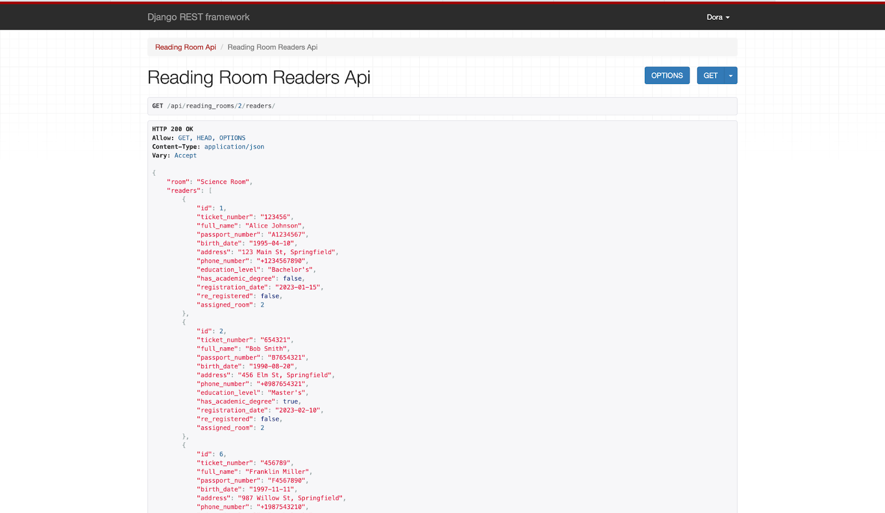
    Эндпоинт `GET /api/reading_rooms/<room_id>/readers/` возвращает список читателей, прикрепленных к указанному читальному залу, включая их данные, такие как номер билета, имя, адрес, уровень образования и другую информацию.

## Эндпоинты для транзакций с книгами

- **Получение списка транзакций с книгами и добавление новой транзакции:**

    - GET и POST: http://127.0.0.1:8000/api/book_transactions/
  
    GET (получение списка транзакций с книгами):
    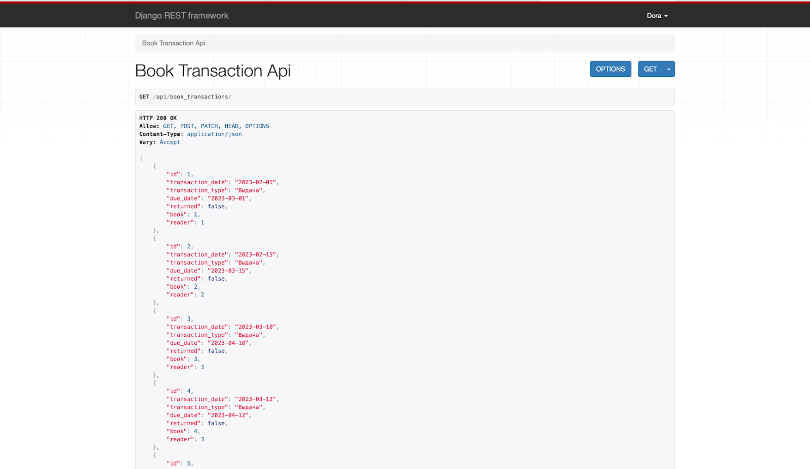
    Эндпоинт `GET /api/book_transactions/` возвращает список всех транзакций с книгами, включая информацию о дате транзакции, типе операции (выдача или возврат), сроке возврата, статусе возврата, а также ID книги и читателя.

    POST (добавление новой транзакции):
    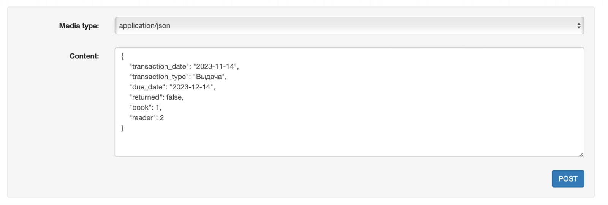
    
    Эндпоинт `POST /api/book_transactions/` используется для создания новой транзакции с книгой. В теле запроса указываются данные о транзакции: дата, тип (например, выдача), срок возврата, статус возврата, а также ID книги и читателя.

    - GET (получение информации o транзакции по id): http://127.0.0.1:8000/api/book_transactions/<int:pk>/
    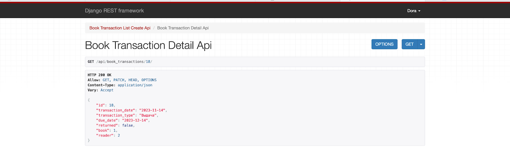
    Эндпоинт `GET /api/book_transactions/<transaction_id>/` возвращает подробную информацию о конкретной транзакции с книгой, включая дату транзакции, тип (например, выдача), срок возврата, статус возврата, а также ID книги и читателя.
  
    - PATCH (отметка возврата книги по id): http://127.0.0.1:8000/api/book_transactions/<int:pk>/
    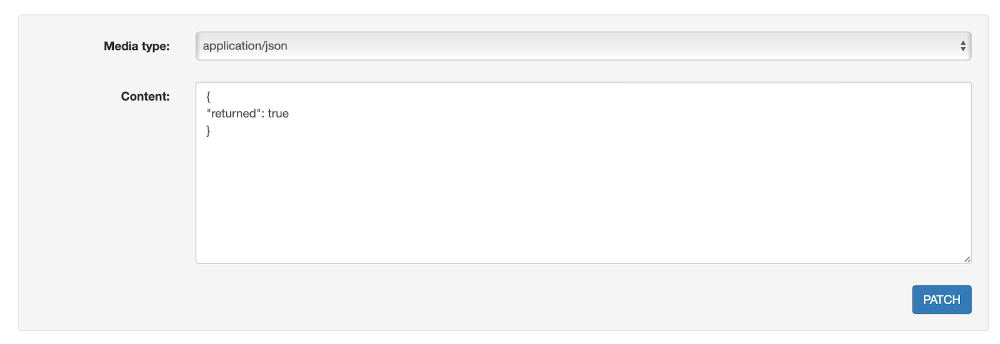
    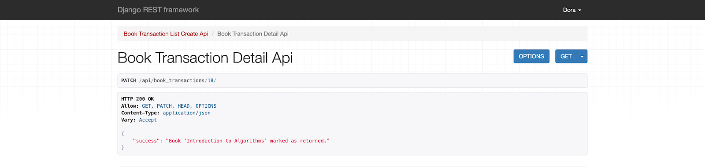
    Эндпоинт `PATCH /api/book_transactions/<transaction_id>/` используется для обновления статуса возврата книги. В теле запроса передается обновленное значение поля `returned`, например, `true`, чтобы отметить, что книга была возвращена.
  

## Эндпоинты для отчетов

- **Получение отчета о работе библиотеки:**

    - GET: http://127.0.0.1:8000/api/reports/
    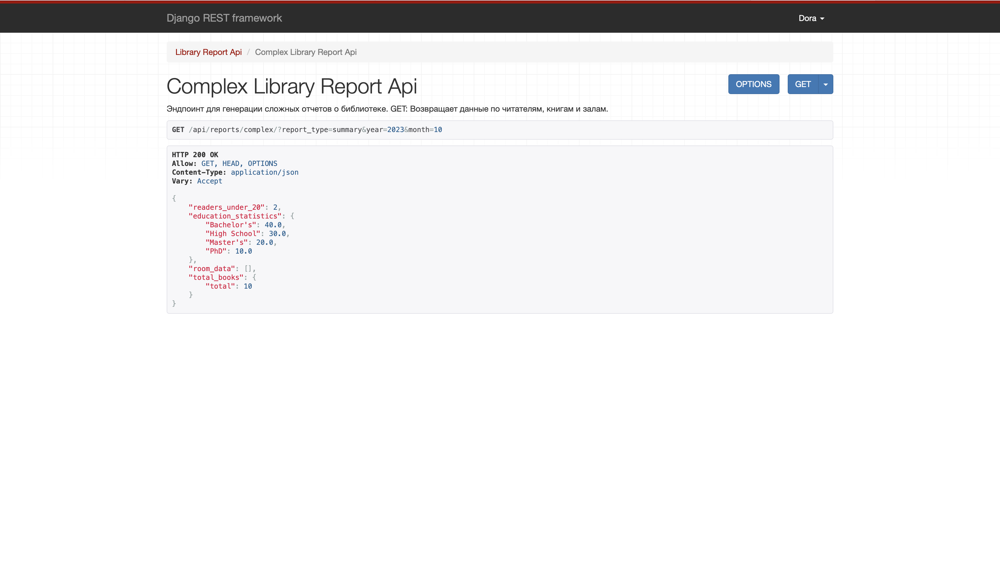
  
    - GET (ежемесячный отчет за конкретный месяц и год): http://127.0.0.1:8000/api/reports/?report_type=monthly&year=2023&month=10 
    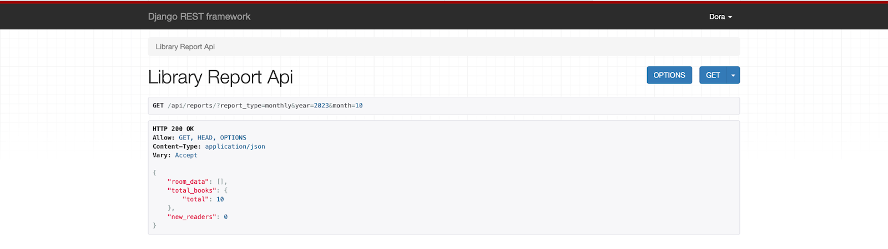
    Эндпоинт `GET /api/reports/?report_type=monthly&year=2023&month=10` предоставляет ежемесячный отчет о библиотеке за октябрь 2023 года. В ответе указываются данные о залах, общее количество книг и число новых читателей за указанный период.
  
    - GET (ежемесячный отчет за весь год): http://127.0.0.1:8000/api/reports/?report_type=monthly&year=2023
    
    Эндпоинт `GET /api/reports/?report_type=monthly&year=2023` возвращает ежемесячный отчет за 2023 год. В ответе отображается информация о залах (названия и количество мероприятий), общем числе книг и количестве новых читателей в течение года.
  
    - GET (отчет со статистикой читателей (образование, возраст)): http://127.0.0.1:8000/api/reports/?report_type=reader_statistics
    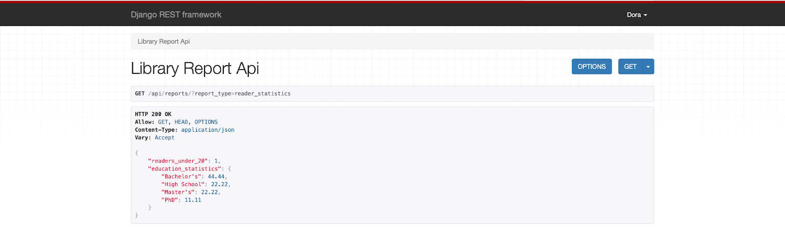
    Эндпоинт `GET /api/reports/?report_type=reader_statistics` предоставляет статистику читателей. Ответ включает количество читателей младше 20 лет и процентное распределение уровней образования: бакалавриат (44.44%), средняя школа (22.22%), магистратура (22.22%) и докторантура (11.11%).
  
    - GET (получение расширенного отчета о состоянии библиотеки): http://127.0.0.1:8000/api/reports/complex/
  
    - GET (сводный отчёт за конкретный месяц и год): http://127.0.0.1:8000/api/reports/complex/?report_type=summary&year=2023&month=10
    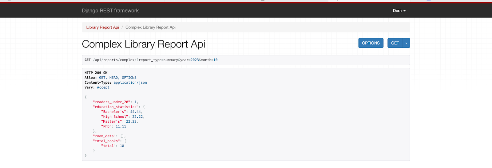
    Эндпоинт `GET /api/reports/complex/?report_type=summary&year=2023&month=10` предоставляет обобщенную статистику за октябрь 2023 года. Ответ включает данные о читателях младше 20 лет, процентное распределение уровней образования, общее количество книг и читателей, а также сведения о заполненности читальных залов.

    - GET (сводный отчет за весь год): http://127.0.0.1:8000/api/reports/complex/?report_type=summary&year=2023
    
    Эндпоинт `GET /api/reports/complex/?report_type=summary&year=2023` возвращает комплексный отчет за указанный год. Данные включают количество читателей младше 20 лет, статистику уровней образования, общее количество книг и читателей, а также данные о читальных залах. `report_type=summary` — указывает, что требуется сводный отчёт.
