# Описание работы всех используемых интерфейсов

**Регистрация**

Для начала надо зарегистрировать нашего библиотакаря.

**Вход**

Теперь надо войти в аккаунт с данными, с которомы мы только что зарегистрировались. 

**Профиль**

И мы попадаем на страницу профиля.

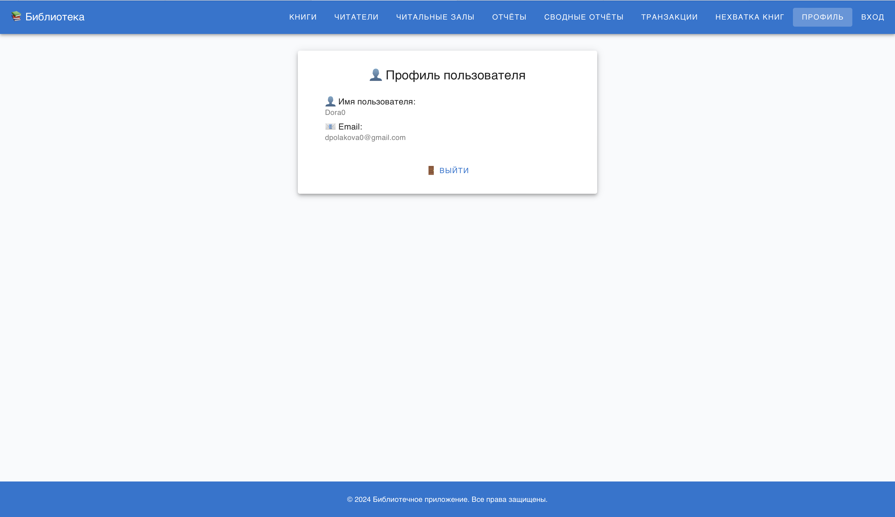

**Книги**

В разделе "Книги" мы можем делать различные действия с книгами. Например, мы можем добавить новую книгу, включая добавление ее копий-экземпляров в различные залы библиотеки. 

В этом же разделе мы можем увидеть весь список книг в библиотеке. 

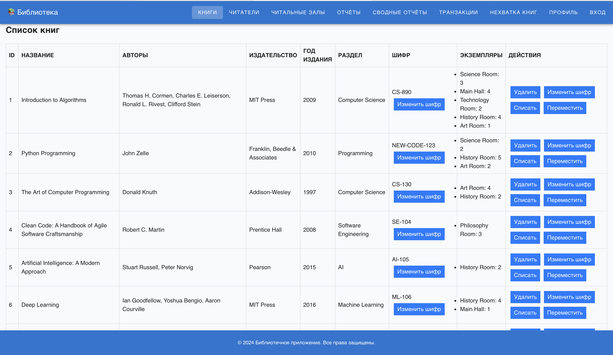

Здесь мы можем изменить шифр любой книги, в том числе, которую только что добавили.

Можно также переместить экземпляры книги в другой зал.

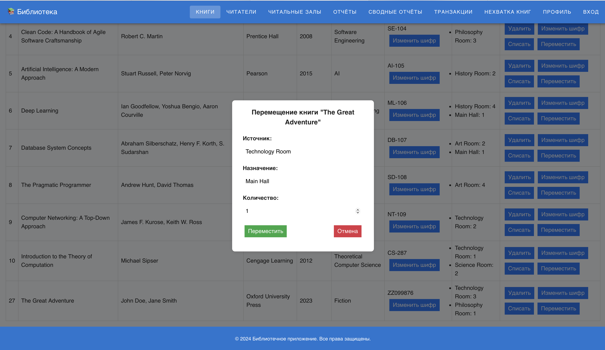

Кроме этого, можно списать или удалить книгу.

**Читатели**

В разделе "Читатели" можно делать различные действия с читателями. Например, мы можем добавить нового читателя. Также, можно добавить параметры наличия ученой степени у читателя, а также пройдена ли повторная регистрация. При создании читателя сразу прикрепляем его к залу.

В этом же разделе мы можем увидеть весь список читателей в библиотеке. 

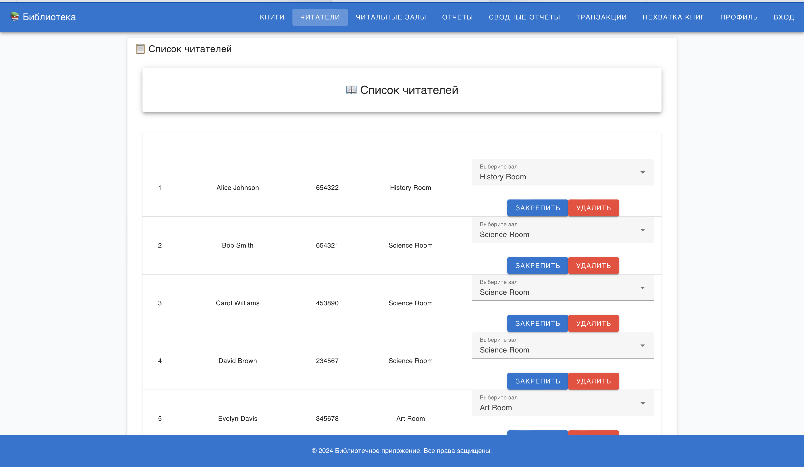

Тут же мы можем перерегистрировать читателся в другой зал.

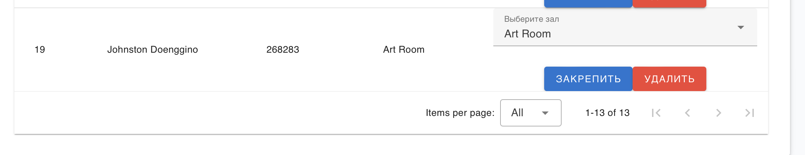

**Читательные залы**

В разделе "Читательные залы" можно делать различные действия с читательными залами. Например, можно добавить новый зал с указанием вместимости. Кроме того, можно просматривать все залы, которые есть в библиотека в разделе "Список читальных залов".

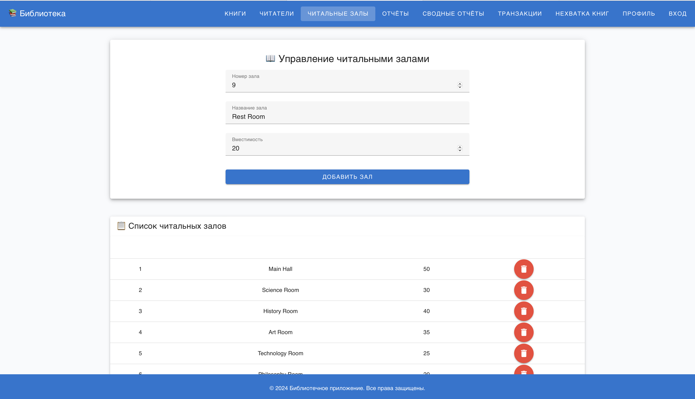

**Отчеты**

В разделе "Отчеты" можно смотреть отчеты за определенные года и месяцы. Здесь видно общее количество книг в библиотеке, а также количество новых читателей за указанное время.

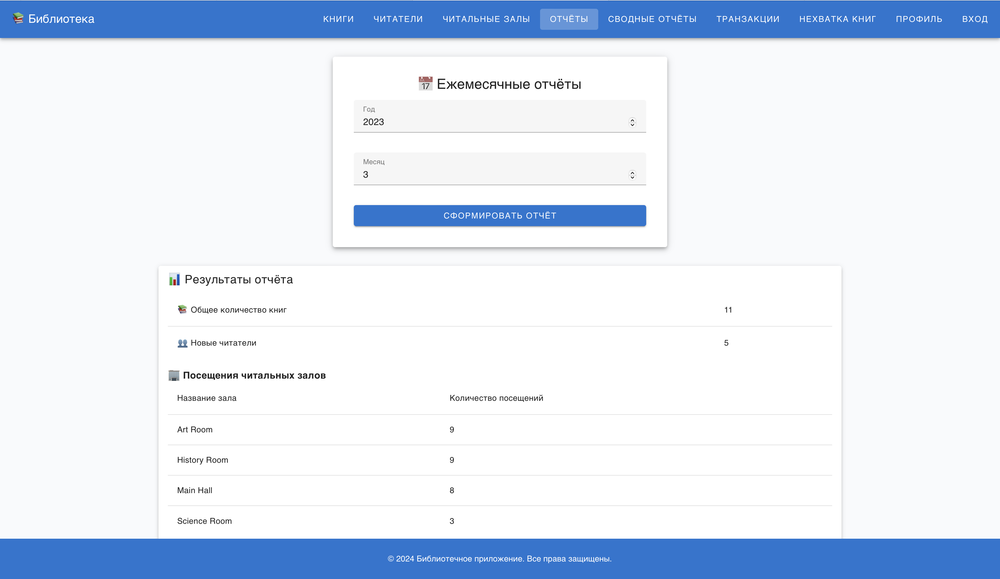

**Сводные отчеты**

В разделе "Сводные отчеты" можно сформировать отчет за определенный год. Здесь можно увидеть информацию о том, сколько в библиотеке читателей младше 20 лет, а образовательную статистику читателей.

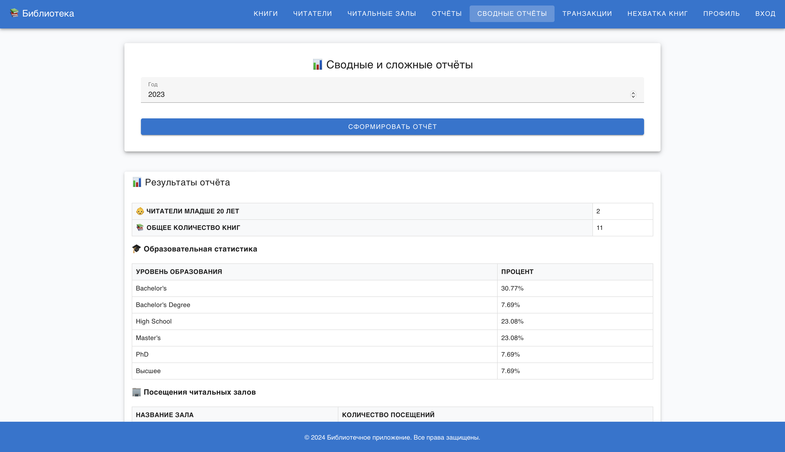

**Транзакции**

В разделе "Транзакции" можно добавить новую транзакцию по взятию или возврату книги читателем. 

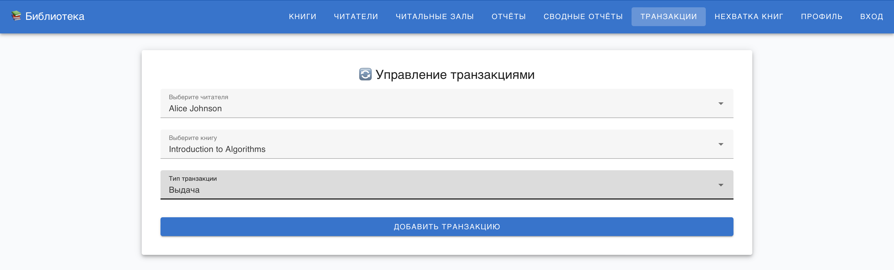

Далее можно посмотреть все транзакции определенного читателя. 

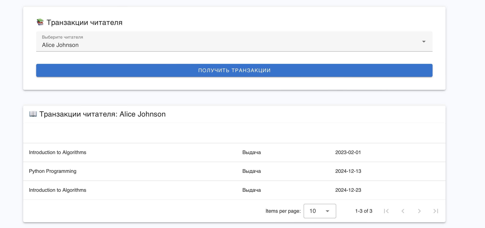

Можно посмотреть список всех транзакций за все время. 

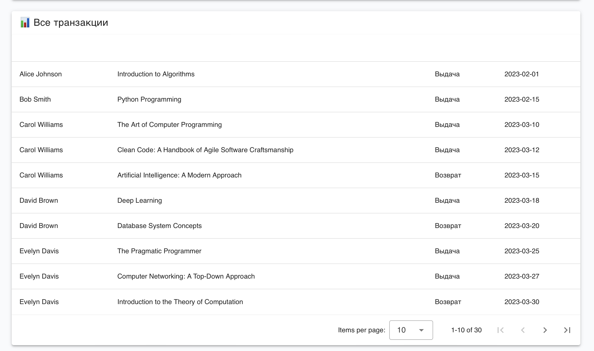

Также можно посмотреть список просроченных транзакций, то есть книги, которые не вернули в библиотеку больше месяца.

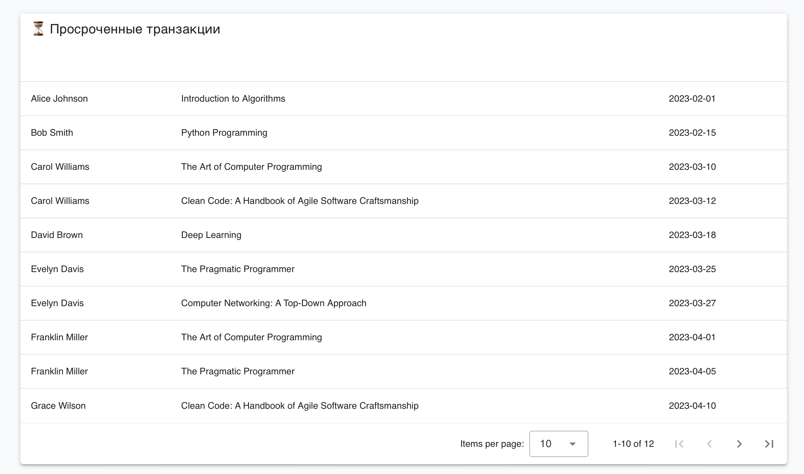

**Нехватка книг**

В разделе "Нехватка книг" можно увидеть книги, количество экземпляров которых не больше двух в библиотеке. Также, мы видим кто взял эти книги.

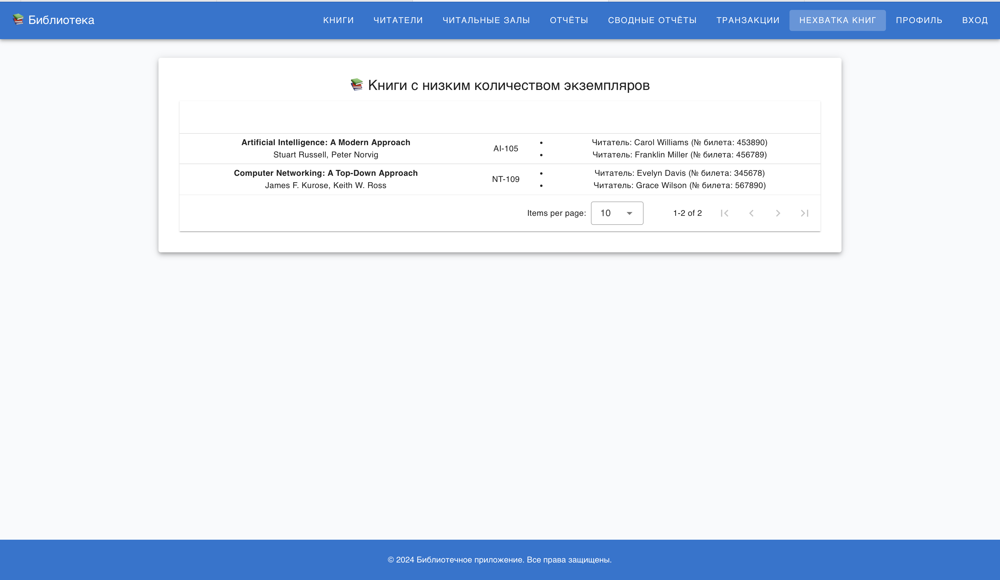

