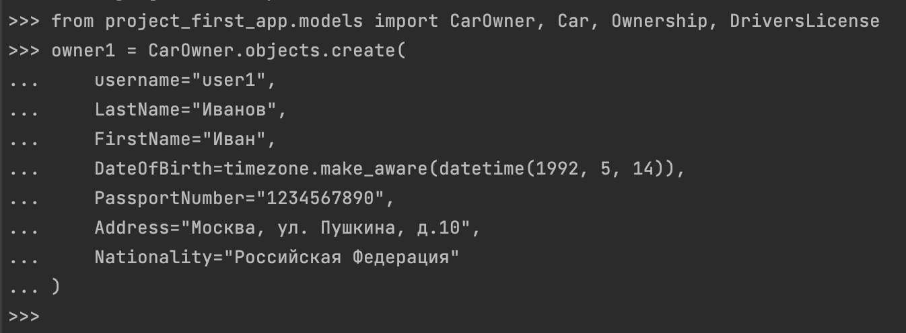
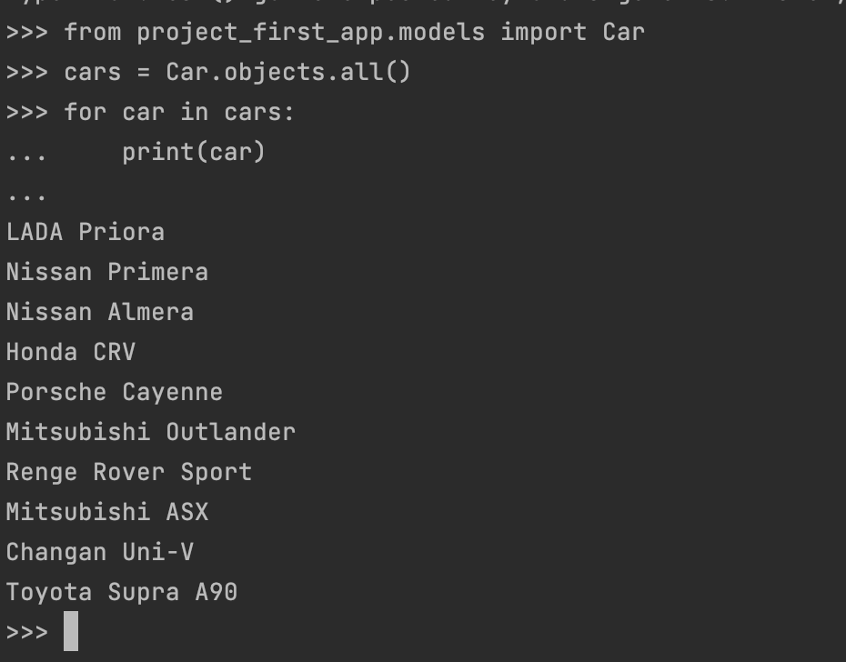
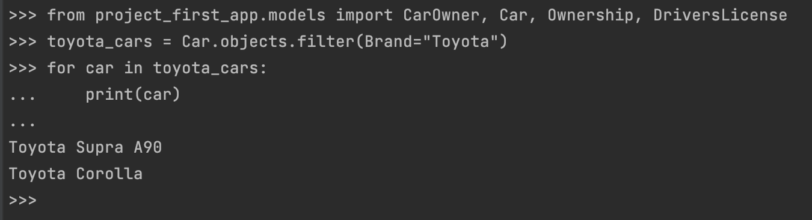
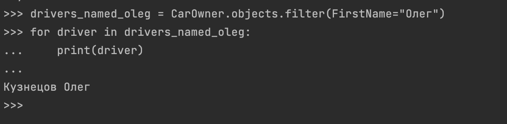
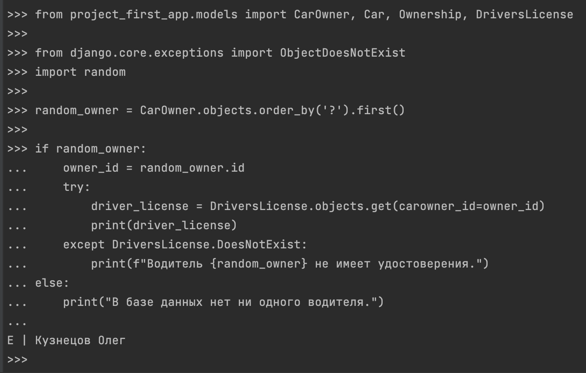
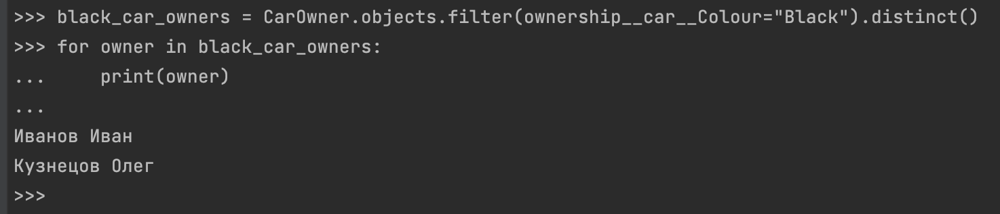
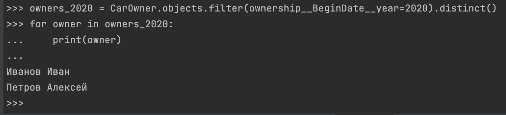
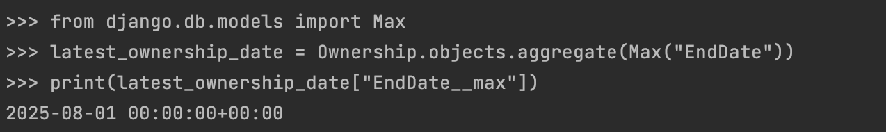
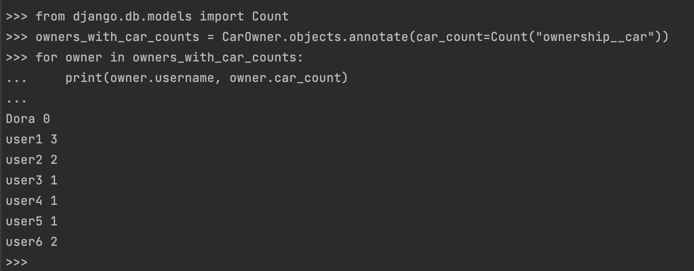
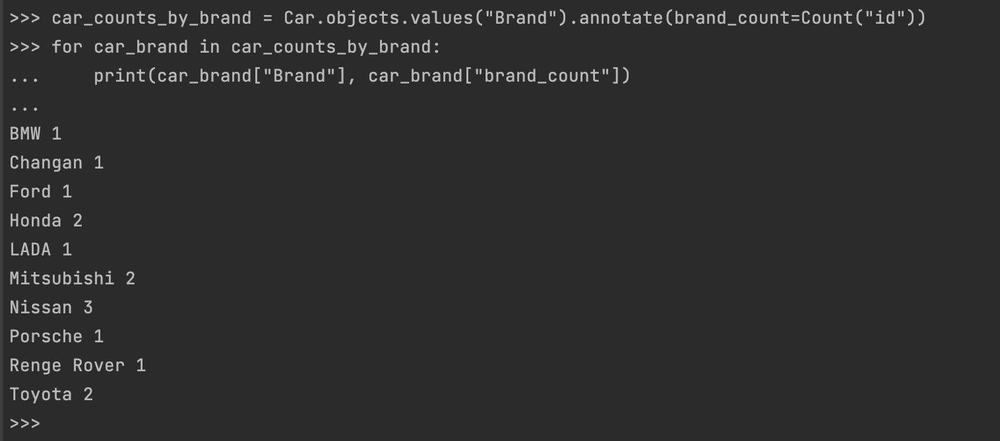

# Практическая работа №3.1. Django Web framework. Запросы и их выполнение

**Практическое задание 1:**
Напишите запрос на создание 6-7 новых автовладельцев и 5-6 автомобилей, каждому автовладельцу назначьте удостоверение и от 1 до 3 автомобилей. Задание можете выполнить либо в интерактивном режиме интерпретатора, либо в отдельном python-файле. Результатом должны стать запросы и отображение созданных объектов. 
Если вы добавляете автомобили владельцу через метод .add(), не забудьте заполнить также ассоциативную сущность “владение”.

**Выполнение задания:**

## Настройка окружения
1) Для начала я перешла в директорию, где находится manage.py: 
```
cd /Users/dariapolyakova/PycharmProjects/Daria_Django/django_project_poliakova
```
2) Далее активировала виртуальное окружение: 
```
source /Users/dariapolyakova/PycharmProjects/Daria_Django/tutorial-env/bin/activate
```
3) Запустила команду для открытия Django shell: 
```
python manage.py shell
```
## Работа в shell
1) Импортируем модули
```
from project_first_app.models import CarOwner, Car, Ownership, DriversLicense
```
2) Посмотрим какие username есть сейчас в нашей бд

3) Создадим 6 новых автовладельцев при помощи запросов 

4) Проверим добавились ли наши юзеры

5) Посмотрим какие есть сейчас машины в бд 

6) Добавим новых 5 машин через запросы

7) Проверим добавились ли они

8) Посмотрим какие есть лицензии в моей бд

9) И понимаем, что пока что ни родной лицензии нет. Каждому автовладельцу назначим удостоверение

10) Проверим бд удостоверений

11) Теперь присвоим авто юзерам

12) Теперь владения авто выглядит так:


**Практическое задание 2:**
По созданным в пр.1 данным написать следующие запросы на фильтрацию:

- Где это необходимо, добавьте `related_name` к полям модели
- Выведите все машины марки "Toyota" (или любой другой марки, которая у вас есть)
- Найти всех водителей с именем "Олег" (или любым другим именем на ваше усмотрение)
- Взяв любого случайного владельца, получить его `id`, и по этому `id` получить экземпляр удостоверения в виде объекта модели (можно в 2 запроса)
- Вывести всех владельцев красных машин (или любого другого цвета, который у вас присутствует)
- Найти всех владельцев, чей год владения машиной начинается с 2010 (или любой другой год, который присутствует у вас в базе)

**Выполнение задания:**

1) Выведете все машины марки “Toyota” (или любой другой марки, которая у вас есть):

2) Найти всех водителей с именем “Олег” (или любым другим именем на ваше усмотрение):

3) Взяв любого случайного владельца получить его id, и по этому id получить экземпляр удостоверения в виде объекта модели (можно в 2 запроса):

4) Вывести всех владельцев красных машин (или любого другого цвета, который у вас присутствует):

5) Найти всех владельцев, чей год владения машиной начинается с 2010 (или любой другой год, который присутствует у вас в базе):


**Практическое задание 3:**

Необходимо реализовать следующие запросы с применением описанных методов:

- Вывод даты выдачи самого старшего водительского удостоверения
- Укажите самую позднюю дату владения машиной, имеющую какую-то из существующих моделей в вашей базе
- Выведите количество машин для каждого водителя
- Подсчитайте количество машин каждой марки
- Отсортируйте всех автовладельцев по дате выдачи удостоверения  
  (Примечание: чтобы не выводить несколько раз одни и те же таблицы воспользуйтесь методом `.distinct()`)

**Выполнение задания:**

1) Вывод даты выдачи самого старшего водительского удостоверения

2) Укажите самую позднюю дату владения машиной, имеющую какую-то из существующих моделей в вашей базе

3) Выведите количество машин для каждого водителя

4) Подсчитайте количество машин каждой марки

5) Отсортируйте всех автовладельцев по дате выдачи удостоверения (Примечание: чтобы не выводить несколько раз одни и те же таблицы воспользуйтесь методом .distinct()).
Для выполнения этого пункта я добавила related_name='licenses' в класс DriversLicense(models.Model).

